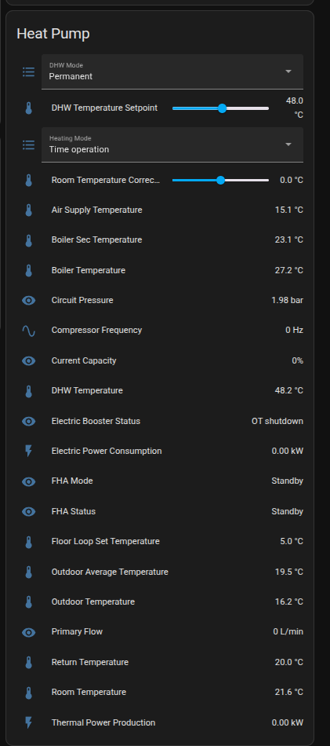
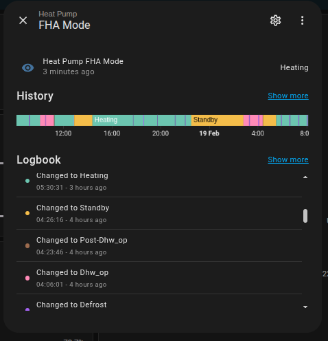
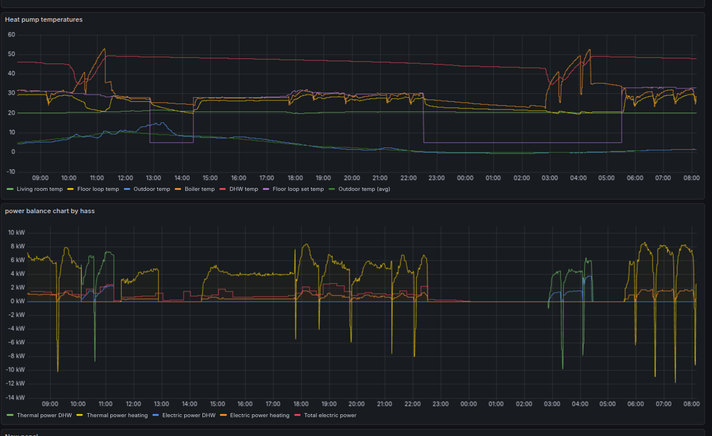

# Direct eBus Integration for Home Assistant (No MQTT Required)

## Overview

ebus_direct connects Home Assistant directly to ebusd over its native TCP interface, eliminating MQTT and enabling advanced, freshness-aware monitoring of eBus heating systems.

This integration is designed for users who want more than basic telemetry — it targets detailed operational analysis of heat pumps and other eBus-based systems.

Instead of the typical:

    eBus → ebusd → MQTT → Home Assistant

this integration uses:

    eBus → ebusd → Home Assistant (direct TCP)

### Why this matters

Compared to MQTT-based setups, this approach provides:

* No MQTT broker required
* Per-sensor control over find vs read logic
* Freshness-aware message selection
* Custom raw message decoding
* Reduced infrastructure complexity
* Better suitability for reverse-engineered or incomplete ebusd definitions

This makes it particularly well suited for:

* Heat pump performance monitoring
* COP and efficiency analysis
* Energy flow tracking
* Reverse engineering of proprietary parameters
* Advanced installations without MQTT infrastructure

## Custom decoding support  
The integration supports custom decoder logic (see '[About custom decoders](https://github.com/Ces1254/home_assistant_ebus_direct/blob/main/ebus_lib/About%20custom%20decoders.md)')  
This makes it suitable for:  
* reverse-engineered devices
* non-standard parameters
* systems with incomplete ebusd definitions

## Requirements

* Home Assistant (tested with recent Core versions)
* Running [ebusd](https://github.com/john30/ebusd) instance with TCP access enabled

Typical setup:

eBus → ebusd → Home Assistant (this integration)

## Installation
Manual installation  
Copy the integration folder into:  

    <config>/custom_components/ebus_direct/

Prepare your entities description by editing the yaml configuration file.  
Add in HA configuration.yaml a block with:  
```yaml
ebus_direct:
  entities_file: path_to_ebus_entities.yaml
```
where the path is relative to HA `<config>` folder.  
It is suggested to enable the message logging by adding in configuration.yaml also:
```yaml
logger:
  default: warning
  logs:
    custom_components.ebus_direct: info
```
For the first run, selecting `debug` allows verifying the correctness of the entities configuration. Once satisfied, the level can be changed to `info` to reduce the chatting of the application. 

Restart Home Assistant.  
Add the integration via:  
    Settings → Devices & Services → Add Integration
    
and configure through the UI the ebusd IP and system names.  

## Configuration

Entities are defined through a configuration structure that includes:

* eBus command or tag
* unit
* device class
* freshness limits

Example:
```yaml
sensors:
  flow_temp:
    name: Flow Temperature
    ebus_find_tag: OP010,OP042
    ebus_read_tag: FlowTemp
    unit: °C
    device_class: temperature
    numeric: True
    min: 0
    max: 80
    max_age: 180
```
In the example above, it is assumed that FlowTemp is the 'name' of a read message (r) in the ebusd configuration .csv file, while OP010 or OP020 are tags in the 'name' of listen messages (u). Note that for find tags, the name of the message can contain multiple tags for messages that transmit multiparameters values, as in the case of the read commands issued by Wolfnet on a Wolf eBus system. In this case, the different tags are separated in the name by '_' (e.g., OP010_OP011_OP012) and the message will encode values for the parameters which will later be found (with the tag OP010, OP011, or OP012). It is possible to define sensors (read only) or controls (read and write), with controls distinct in numbers (with optional step changes) and selects (with pull-down menu selection).  Refer to the attached `ebus_entities.yaml` configuration for a templete of the entities declarations.   

## Examples:   
### Entities exposed to HA

The entities exposed by ebus_direct to HA include sensors, numbers, and selects.



### Operational State Tracking

State transitions such as Heating, Standby, DHW operation, and Defrost cycles are recorded directly from eBus messages and exposed as native Home Assistant entities.



### Performance Monitoring (Grafana)

The integration is optimized for high-resolution logging and long-term performance analysis.
Below: COP tracking and flow/return temperature analysis via Grafana.



## Standalone Testing (without Home Assistant)

The core eBus communication logic is implemented in a Home-Assistant-independent module.
This allows testing and debugging the connection to ebusd without running Home Assistant.

A simple standalone script is provided in:

scripts/main.py

### Requirements

* Python 3.10 or newer
* Access to a running ebusd instance with TCP enabled

### Running the test script

First edit main.py line 19 (EBUSD_HOST) with the IP address that allows you to connect to ebusd.   
Then, from the project root directory:

``` bash
python -m scripts.main
```

The script connects directly to the configured ebusd instance and performs basic read or find operations.
It is intended for:

* debugging connection issues
* testing new sensors or message tags
* validating decoding logic
* reverse-engineering unknown parameters

### When to use standalone mode

Standalone testing is useful when:

* Home Assistant is not yet installed
* you want to debug low-level eBus communication
* you are developing or testing new decoders
* you want faster iteration without restarting Home Assistant

This mode does not create Home Assistant entities.  
It is strictly a diagnostic and development tool.  

## Status

* Actively developed
* Tested on systems using ebusd
* Initial focus on heat pump monitoring

## Contributing

Contributions are welcome, especially:  
* additional sensor definitions
* decoders for other eBus devices
* testing on different systems

## Disclaimer

This project is:  
* not affiliated with any heating system manufacturer
* not an official ebusd component
* provided as-is, without warranty

### Use at your own risk.

